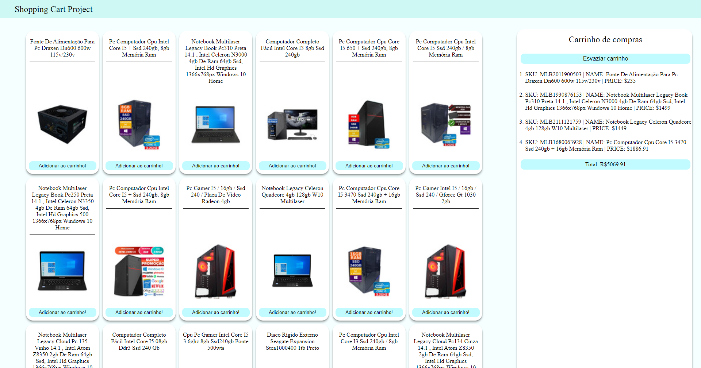

## Shopping Cart

This was a project developed in the [Software Development Course at Trybe](https://www.betrybe.com/formacao-desenvolvimento-web) as a challenge while I was learning how to use Async/Await Functions. In this project I was able to catch products from [Mercado Libre API](https://developers.mercadolivre.com.br/pt_br/itens-e-buscas) and use Async and Await functions to show our users their selected products and how much they will spend buying them. Made on ```July 8th, 2021```.

### How to download and run the project code

First of all you need to download the project files, you can do this using git.

```bash
git clone git@github.com:erick-ol/js-shopping-cart.git
```

After you clone the repository you need to enter the folder that contains the project you just downloaded and install all the dependencies of this application.

```bash
npm install
```

Then you just need to enter the application folder and open your ```index.html``` file on the browser.


### Images from the project

